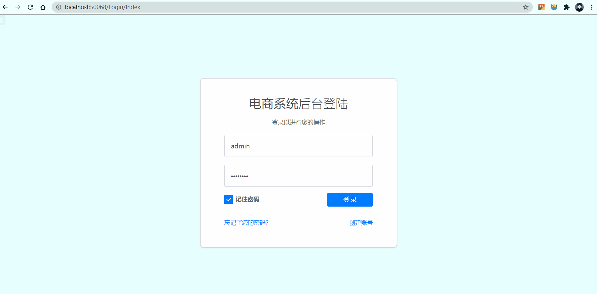
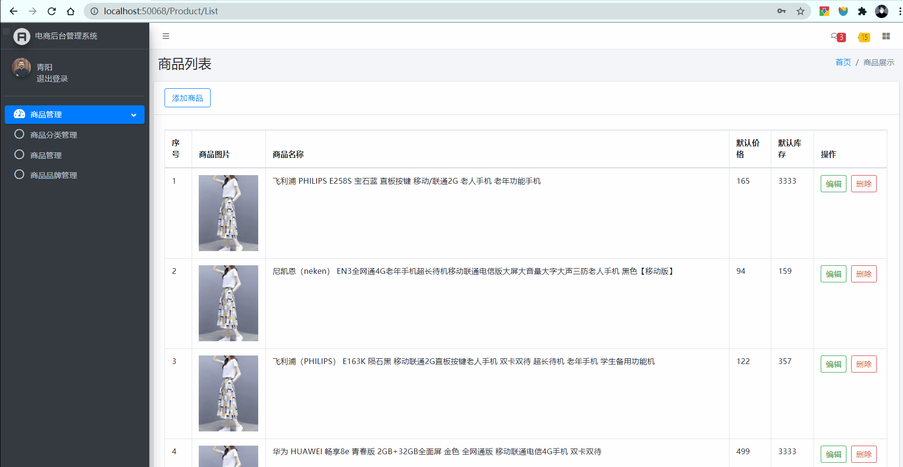
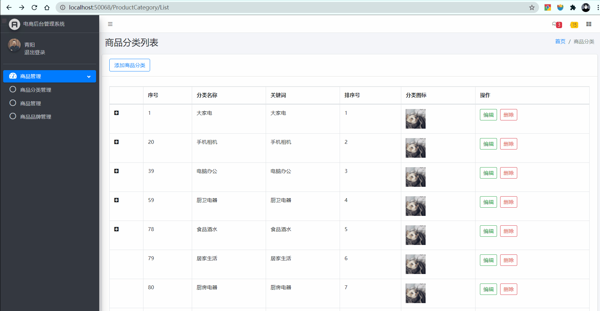
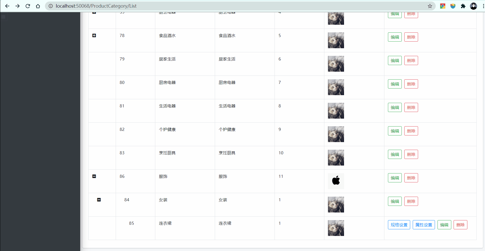

# 1. Shop
## 1.1. 基于Asp.Net的电商后台管理系统

  
  
   

前台采用微信小程序交互[Shop-mini-program](https://github.com/hklvia/Shop-mini-program)
目前更新中....
## 1.2. 项目展示：
### 1.2.1. 登录页

### 1.2.2. 商品列表

### 1.2.3. 商品添加和修改

### 1.2.4. 商品分类列表

### 1.2.5. 商品属性SKU

### 1.2.6. 品牌添加

